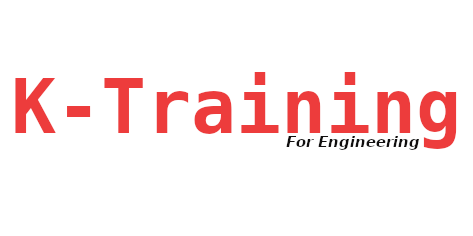

|  |  
|:---------------------------------:|
| **[About](README.md#about)**    **[Trainings](README.md#trainings)** |

## About
## Trainings
<table style="width: 100%;">
 
<tbody>
<tr>
<td style="width: 17%;"> </td>
<td style="width: 83%; vertical-align: middle; text-align: left;"> <h5><b><a href="sub/lvgl">Developing with LVGL for embedded systems >></a></b></h5></td>
</tr>
<tr>
<td style="width: 17%;"> </td>
<td style="width: 83%; vertical-align: middle; text-align: left;"> <h5><b>The linux system programmer >></b></h5></td>
 </tr>
     
</tbody>
</table>

 

K-Training 2025.

36, Avenue Habib Bourguiba, Ezzahra
Tunisia.

